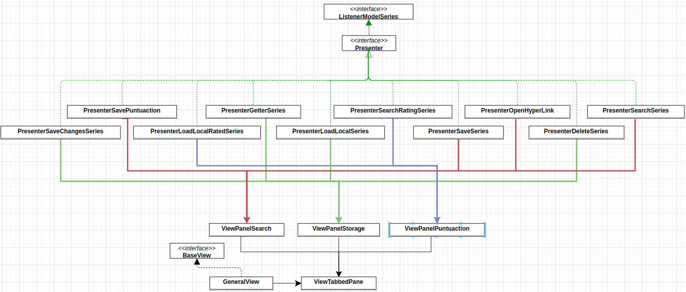
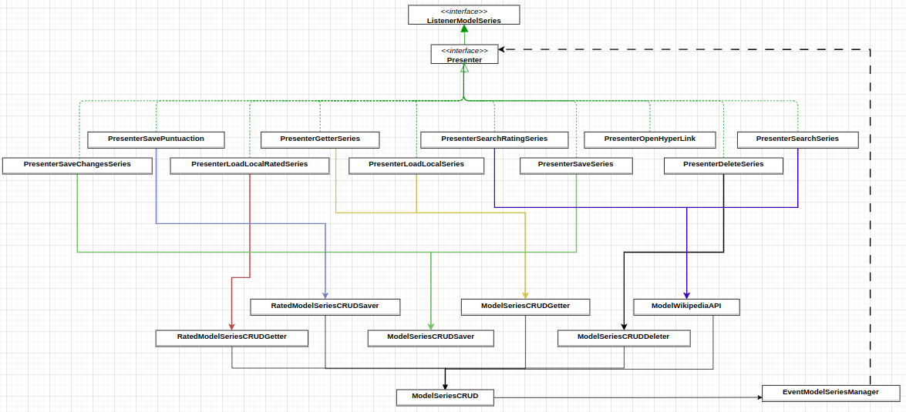

# TV Series Info Repo

## Proyecto DyDS - Universidad Nacional del Sur

**Autor:** [Franco Leon](https://github.com/francoleon08)

# Proyecto TV Series Info

## Objetivos

La aplicación “TV Series Info Repo” ha sido sometida a un exhaustivo proceso de rediseño para mejorar su arquitectura, código y diseño, siguiendo los principios de MVP (Modelo-Vista-Presentador), Clean Code y SOLID. Los objetivos principales de este sprint fueron:

- Modelar el código fuente para que respete el patrón MVP.
- Segregar las funcionalidades de la aplicación en distintas clases.
- Desarrollar código legible.
- Desarrollar módulos desacoplados y reutilizables.
- Rediseñar la interfaz de usuario para garantizar una mejor experiencia, mediante notificaciones claras y concisas.

## Principios de Clean Code y SOLID

El rediseño completo de la aplicación se realizó siguiendo los principios SOLID y Clean Code. Esto es visible en cada clase o método que fue implementado o rediseñado.

### Prácticas adoptadas:

- **Nombres descriptivos:** Se utilizaron nombres de variables, métodos y clases descriptivos para mejorar la comprensión del código.
- **Funciones pequeñas y cohesivas:** Se dividió el código en funciones más pequeñas y cohesivas para mejorar la modularidad y facilitar las pruebas.
- **Un nivel de abstracción:** Se siguió esta regla para lograr funciones que cumplan con el principio de responsabilidad única.
- **Regla de código descendente:** Se siguió esta regla para mejorar la lectura del mismo.
- **Eliminación de código duplicado:** Se identificó y eliminó el código duplicado para promover la reutilización y reducir la complejidad.

## Patrones de Diseño Utilizados

### 1. Observer
Utilizado en la clase `EventModelSeriesManager` para conectar a los presentadores con sus modelos respectivos de forma desacoplada.

### 2. Factory Method
Implementado para la creación de instancias necesarias para el funcionamiento correcto de la aplicación, promoviendo flexibilidad y extensibilidad del código.

### 3. Builder
Empleadado para la construcción de las entidades `Series` y `RatedSeries`, permitiendo una creación flexible de instancias.

### 4. Singleton
Aplicado a los modelos de la aplicación para garantizar que los presentadores compartan la misma instancia de un objeto, optimizando el uso de recursos y manteniendo la coherencia de los datos.

## Testing

### Estrategia de Testing Adoptada:

- **Testing unitario en solitario para los modelos:** Utilizando `Mockito` para aislar correctamente los modelos de sus dependencias.
- **Testing de integración:** Comienza en un presentador que captura un evento de la vista, con los resultados capturados en la vista correspondiente. Utiliza un stub general para simular el acceso a datos.

La organización del testing fue fundamental para garantizar la calidad y fiabilidad de la aplicación, permitiendo identificar y corregir errores y mejorar la funcionalidad.

## Diagrama de Clases Reducido

### Conexión entre las vistas y los presentadores (Figura 1)



### Conexión entre los presentadores y los modelos (Figura 2)



## Instalación y Uso - Gradle

Sigue estos pasos para instalar y utilizar la aplicación:

1. **Clonar el repositorio:**
   ```bash
   git clone "https://github.com/francoleon08/proyecto-dyds.git"
   ```
2. **Construir el proyecto:**
   ```bash
   cd proyecto-dyds
   gradle build
   ```
3. **Ejecutar la aplicación:**
   ```bash
   gradle run
   ```